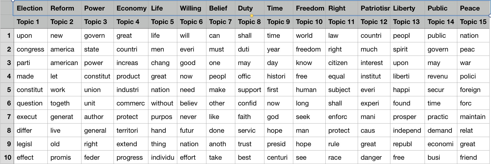

The inauguration speeches are always one of the most important events of the presidents, and they contain lots of messages and information. In this project, we will focus on the inauguration speeches of the US presidents ** who were re-elected (successfully)** by applying Natural Language Processing (NLP) methods.

# I. Overview of the data

The President of the United States is the head of state and head of government of the United States of America and the term of office for the president is four years. Franklin D. Roosevelt, as we known, was elected to a 3rd and a 4th term, and died in his president office. In response to Roosevelt being elected to four terms, the Twenty-second Amendment was adopted in 1951. The amendment bars anyone from being elected president more than twice term, and since then, many presidents chose to re-elect in the 2nd term and quit before the 3rd term (if they get re-elected).

In the project, We only choose all inauguration speeches of every president. 58 speeches are considered. We usually consider 16 getting re-elected presidents and thus 32 speeches (16 from their 1st term speech, and other 16 from 2nd's).


Before we make a text analysis, we should do some preparation first. 

>Fun Fact: All unnecessary R-code is hide in html file. If you want to check my program, please find it in the Rmd file.


```{r, message=FALSE, warning=FALSE, echo = FALSE}
packages.used=c("rvest", "tibble", "qdap", 
                "sentimentr", "gplots", "dplyr",
                "tm", "syuzhet", "factoextra", 
                "beeswarm", "scales", "RColorBrewer",
               "RANN", "tm", "topicmodels")
# rvest: scrap data online
# tibble: deal with table data
# qdap: quantitive method esp. text mining
# sentimentr: sentiment
# gplots: plot
# dplyr: pre-process, apply
# tm: text-mining

# check packages that need to be installed.

# load packages
library("rvest")
library("tibble")
# You may need to run
# sudo ln -f -s $(/usr/libexec/java_home)/jre/lib/server/libjvm.dylib /usr/local/lib
# in order to load qdap
library("qdap")
library("sentimentr")
library("gplots")
library("dplyr")
library("tm")
library("syuzhet")
library("factoextra")
library("beeswarm")
library("scales")
library("RColorBrewer")
library("RANN")
library("tm")
library("topicmodels")

library(wordcloud)
library(tidytext)

source("../lib/plotstacked.R")
source("../lib/speechFuncs.R")
```


```{r, message=FALSE, warning=FALSE, echo = FALSE}
### Inauguaral speeches
main.page <- read_html(x = "http://www.presidency.ucsb.edu/inaugurals.php")
# Get link URLs
# f.speechlinks is a function for extracting links from the list of speeches. 
inaug=f.speechlinks(main.page)
#head(inaug)
inaug=inaug[-nrow(inaug),] # remove the last line, irrelevant due to error.
```


```{r, echo = FALSE}
inaug.list=read.csv("../data/inauglist.csv", stringsAsFactors = FALSE)
```


```{r, echo = FALSE}
speech.list=inaug.list
speech.list$type=c(rep("inaug", nrow(inaug.list)))
speech.url=inaug
speech.list=cbind(speech.list, speech.url)
```


```{r, echo= FALSE}
# Loop over each row in speech.list
speech.list$fulltext=NA
for(i in seq(nrow(speech.list))) {
  text <- read_html(speech.list$urls[i]) %>% # load the page
    html_nodes(".displaytext") %>% # isloate the text
    html_text() # get the text
  speech.list$fulltext[i]=text
  # Create the file name
  filename <- paste0("../data/InauguralSpeeches/", 
                     speech.list$type[i],
                     speech.list$File[i], "-", 
                     speech.list$Term[i], ".txt")
  sink(file = filename) %>% # open file to write 
  cat(text)  # write the file
  sink() # close the file
}
```


```{r, message=FALSE, warning=FALSE, echo = FALSE}
sentence.list=NULL
for(i in 1:nrow(speech.list)){
  sentences=sent_detect(speech.list$fulltext[i],
                        endmarks = c("?", ".", "!", "|",";"))
  if(length(sentences)>0){
    emotions=get_nrc_sentiment(sentences)
    word.count=word_count(sentences)
    # colnames(emotions)=paste0("emo.", colnames(emotions))
    # in case the word counts are zeros?
    emotions=diag(1/(word.count+0.01))%*%as.matrix(emotions)
    sentence.list=rbind(sentence.list, 
                        cbind(speech.list[i,-ncol(speech.list)],
                              sentences=as.character(sentences), 
                              word.count,
                              emotions,
                              sent.id=1:length(sentences)
                              )
    )
  }
}
```


```{r, echo= FALSE}
sentence.list=
  sentence.list%>%
  filter(!is.na(word.count)) 

```

# II: Data processing -- Word frequency and Sentence length

## II.1 sentence length and speech length

Some people would like to say something in a long complex sentence with flexible and diversified adjectives and dazzling subordinate clauses, while others make it simple. 

Let's focus on the sentence length of each speeches to have a look at presidents' habit.

#### First term

```{r, echo=FALSE}

par(mar=c(4, 9, 2, 2))

sentence.list.inaug=filter(sentence.list, Term==1)

sentence.list.inaug$File=factor(sentence.list.inaug$File)

sentence.list.inaug2=filter(sentence.list, Term==2, File%in% sentence.list.inaug$File)

sentence.list.inaug=filter(sentence.list, Term==1, File%in%sentence.list.inaug2$File)


sentence.list.inaug$FileOrdered=reorder(sentence.list.inaug$File, 
                                  sentence.list.inaug$word.count, 
                                  mean, 
                                  order=T)

beeswarm(word.count~FileOrdered, 
         data=sentence.list.inaug,
         horizontal = TRUE, 
         pch=16, col=alpha(brewer.pal(9, "Set1"), 0.6), 
         cex=0.45, cex.axis=0.7, cex.lab=0.9,
         spacing=8/nlevels(sentence.list.inaug$FileOrdered),
         las=2, xlab="Number of words in a sentence.", ylab="",
         main="Inauguration speeches, 1st term")

```

The plot above shows how many words there are in each sentences of speech. They are ordered by the mean of sentence length. George Washington, as the 1st president and one of the Founding Fathers, would like to give a very long sentence speech; George W. Bush prefered to represent his ideas with least words in a sentence. ~~Donald Trump's sentence is even less.~~

> Fun Fact: One sentence from Geroge Washinton's inaguration speech reached 100 words. The other president who can made it is James Monroe.


#### Second term

```{r, echo=FALSE}

par(mar=c(4, 9, 2, 2))
Comp <- function(x)
{
  Names <- c("GeorgeWashington", "AndrewJackson", "JamesMadison", "WilliamMcKinley", "ThomasJefferson", "UlyssesSGrant", "JamesMonroe", "AbrahamLincoln", "WoodrowWilson", "BarackObama", "DwightDEisenhower", "FranklinDRoosevelt", "RichardNixon", "RonaldReagan", "WilliamJClinton", "GeorgeWBush")
  for (i in 1:16)
    if (x == Names[i])
      return(i)
}

####inaug 2nd terms
#sentence.list.inaug2=filter(sentence.list, 
#                        type=="inaug", Term==2, File %in% sentence.list.inaug$File)
for (i in 1:length(sentence.list.inaug2$File))
{
  sentence.list.inaug2$File[i] <- paste(sentence.list.inaug2$File[i], ",", Comp(sentence.list.inaug2$File[i]))
}

sentence.list.inaug2$File=factor(sentence.list.inaug2$File)

sentence.list.inaug2$FileOrdered=reorder(sentence.list.inaug2$File, 
                                  sentence.list.inaug2$word.count, 
                                  mean, 
                                  order=T)

beeswarm(word.count~FileOrdered, 
         data=sentence.list.inaug2,
         horizontal = TRUE, 
         pch=16, col=alpha(brewer.pal(9, "Set1"), 0.6), 
         cex=0.55, cex.axis=0.7, cex.lab=0.9,
         spacing=3/nlevels(sentence.list.inaug2$FileOrdered),
         las=2, xlab="Number of words in a sentence.", ylab="",
         main="Inaugration speeches, 2nd term")
```

We can compare the presidents' sentence length in each term. From the plot above, the number behind the president's name represents his ranking in the first plot. The ranking looks increasing instead of random suggust that every president has his own pace of the inauguration speech.

```{r, echo=FALSE}
par(mfrow=c(1,2))
Presidents2terms <- data.frame(names(tapply(sentence.list.inaug$word.count, sentence.list.inaug$File, sum)))
names(Presidents2terms) <- c("Name")

Presidents2terms $WordCountSum1st <- as.vector(tapply(sentence.list.inaug$word.count, sentence.list.inaug$File, sum))
Presidents2terms $WordCountMean1st <- as.vector(tapply(sentence.list.inaug$word.count, sentence.list.inaug$File, mean))

Presidents2terms $WordCountSum2nd <- as.vector(tapply(sentence.list.inaug2$word.count, sentence.list.inaug2$File, sum))
Presidents2terms $WordCountMean2nd <- as.vector(tapply(sentence.list.inaug2$word.count, sentence.list.inaug2$File, mean))
Presidents2terms $Party <- factor(c("Republican", "Democratic", "Democratic", "Republican", "Democratic", NA, "Republican", "Democratic-Republican", "Democratic-Republican", "Republican", "Republican", "Democratic-Republican", "Republican", "Democratic", "Republican", "Democratic"))

Presidents2terms $ WordSum <- Presidents2terms $WordCountSum1st
Presidents2terms $ WordMean <- Presidents2terms $WordCountMean1st

Presidents2terms $StartYear <- c(1861, 1829, 2009, 1953, 1933, 1789, 2001, 1809, 1817, 1969, 1981, 1801, 1869, 1993, 1897, 1913)

Presidents2terms <- rbind(Presidents2terms, Presidents2terms)
Presidents2terms $ Term <- factor(c(rep(1, 16), rep(2, 16)))

Presidents2terms $ WordSum[Presidents2terms $ Term == 2] <- Presidents2terms $WordCountSum2nd[Presidents2terms $ Term == 2]
Presidents2terms $ WordMean[Presidents2terms $ Term == 2] <- Presidents2terms $WordCountMean2nd[Presidents2terms $ Term == 2]

ggplot(data = Presidents2terms, aes(as.character(StartYear), WordMean, group = Term, fill = Term, color = Term)) + geom_smooth(method = "loess") + geom_col(position = "dodge", alpha = 0.3) + xlab("Started year of President") + ylab("Average words/setence") + ggtitle("average words per sentence in Inauguration Speeches") + theme(plot.title = element_text(hjust = 0.5))

```

If we check the data in a time order, we would find that the average sentence length is decreasing, which infer the writing habit is changed over decades. The fact that two term lines are close shows that the president did not change their writing habit in 4 years.

```{r, echo=FALSE}
ggplot(data = Presidents2terms, aes(as.character(StartYear), WordSum, group = Term, fill = Term, color = Term)) + geom_smooth(method = "loess") + geom_col(position = "dodge", alpha = 0.3) + xlab("Started year of President") + ylab("Number of words") + ggtitle("number of words in Inauguration Speeches") + theme(plot.title = element_text(hjust = 0.5))

```
This plot show the whole passage length in inauguration speech. From the plot the 2nd term line is below the 1st line before 1980. One possibility is that the repeated official words could be omitted. In the past 30 year two lines are very close, which means the two term inauguration speech are of equal importance.

## II.2 word frequency

Another vital analysis is the word frequency. Why is it important? By finding which words a president was likely to say, we could be able to analyze the president's character, political position, personal intension and even future action.

For example, I wrote a function to check whther a president says a word in his inauguration speeches. Here are some examples: 

1. Obama showed his intense advocacy of gay right by mentioning it in the inauguration speech;
2. "Great" could be Donald Trump's pet phrase;
3. Abraham Lincoln talked about war many time during the Civil War; 
4. Because of 911 attacks and the Iraq war, the unfrequent word "tranny" appeared 5 times, and the word "freedom" appeared 22 times.

```{r}
Search_Words <- function(Word, Name, Terms)
{
  Str <- as.matrix(sentence.list%>%filter(File == Name, Term == Terms) 
                   %>% select(sentences))
  return(Str[grep(Word, Str)])
}
## Search "Word" From President's "Name"

Search_Words("gay", "BarackObama", 2)

length(Search_Words("great", "DonaldJTrump", 1))

length(Search_Words("war", "AbrahamLincoln", 2))

length(Search_Words("tyranny", "GeorgeWBush", 2))

length(Search_Words("freedom", "GeorgeWBush", 2))
```

With WordCloud programme we can analyze which words did they speak with large frequency.
```{r, warning= FALSE, echo=FALSE}
par(mfrow=c(1,2))

folder.path="../data/InauguralSpeeches1/"
ff.all<-Corpus(DirSource(folder.path))
ff.all<-tm_map(ff.all, stripWhitespace)
ff.all<-tm_map(ff.all, content_transformer(tolower))
ff.all<-tm_map(ff.all, removeWords, stopwords("english"))
ff.all<-tm_map(ff.all, removeWords, character(0))
ff.all<-tm_map(ff.all, removePunctuation)
tdm.all<-TermDocumentMatrix(ff.all)
tdm.tidy=tidy(tdm.all)
tdm.overall=summarise(group_by(tdm.tidy, term), sum(count))
wordcloud(tdm.overall$term, tdm.overall$`sum(count)`,
          scale=c(5,0.5),
          max.words=100,
          min.freq=1,
          random.order=FALSE,
          rot.per=0.3,
          use.r.layout=T,
          random.color=FALSE,
          colors=brewer.pal(5,"Set1"))
Words <- sort(rowSums(as.matrix(tdm.all)),decreasing=TRUE)
MostWord1 <- data.frame(word = names(Words), freq = Words)
```

```{r, warning= FALSE, echo=FALSE}

folder.path="../data/InauguralSpeeches2/"
ff.all<-Corpus(DirSource(folder.path))
ff.all<-tm_map(ff.all, stripWhitespace)
ff.all<-tm_map(ff.all, content_transformer(tolower))
ff.all<-tm_map(ff.all, removeWords, stopwords("english"))
ff.all<-tm_map(ff.all, removeWords, character(0))
ff.all<-tm_map(ff.all, removePunctuation)
tdm.all<-TermDocumentMatrix(ff.all)
tdm.tidy=tidy(tdm.all)
tdm.overall=summarise(group_by(tdm.tidy, term), sum(count))
wordcloud(tdm.overall$term, tdm.overall$`sum(count)`,
          scale=c(5,0.5),
          max.words=100,
          min.freq=1,
          random.order=FALSE,
          rot.per=0.3,
          use.r.layout=T,
          random.color=FALSE,
          colors=brewer.pal(5,"Set1"))
Words <- sort(rowSums(as.matrix(tdm.all)),decreasing=TRUE)
MostWord2 <- data.frame(word = names(Words), freq = Words)
```

>FunFact: "Will" is the word that presidents use the most time, which makes "inauguration speeches" become to a kind of "future plan".


Above picture is the word cloud of two terms (L: 1st, R: 2nd). Words in two pictures are slightly difference, indicates that the mood of inauguration speech doesn't change from 1st term to 2nd term. 

```{r, echo=FALSE}
MostWordTotal <- merge(MostWord1[1:15,], MostWord2, by = "word", all.x = TRUE)
PlotWord <- data.frame(MostWord1[1:15,])
PlotWord$term <- rep(1, 15)
PlotWord2 <- cbind(MostWordTotal[,c(1, 3)], rep(2, 15))
names(PlotWord2) <- c("word", "freq", "term")
rownames(PlotWord2) <- PlotWord2$word
PlotWord <- rbind(PlotWord, PlotWord2)
PlotWord$term <- factor(PlotWord$term)
PlotWord$obj = PlotWord$word
PlotWord$obj <- factor(PlotWord$obj, levels=PlotWord$word[order(PlotWord$freq[1:15], decreasing = TRUE)])

ggplot(PlotWord, aes(obj, freq, fill = term, group = term, colour = term)) +
  geom_bar(stat='identity', position="dodge", width = 0.6) + 
  ggtitle("")+ scale_x_discrete(name="word") +scale_y_continuous(name ="count")
```
From the picture above, 15 most frequent word in 1st term speech is printed orderly. We can see that all the modal verbs(will, can, shall) have a sharp decrease from term one to term two. A possible reason is that in the first term speech presidents would have enough passion to the citizen, and in the second term that passion decreases.

```{r, echo=FALSE}
MostWordTotal <- merge(MostWord1, MostWord2[1:15,], by = "word", all.y = TRUE)
PlotWord <- data.frame(MostWord2[1:15,])
PlotWord$term <- rep(2, 15)
PlotWord2 <- cbind(MostWordTotal[,c(1, 2)], rep(1, 15))
names(PlotWord2) <- c("word", "freq", "term")
rownames(PlotWord2) <- PlotWord2$word
PlotWord <- rbind(PlotWord, PlotWord2)
PlotWord$term <- factor(PlotWord$term)
PlotWord$obj = PlotWord$word
PlotWord$obj <- factor(PlotWord$obj, levels=PlotWord$word[order(PlotWord$freq[1:15], decreasing = TRUE)])

ggplot(PlotWord, aes(obj, freq, fill = term, group = term, colour = term)) +
  geom_bar(stat='identity', position="dodge", width = 0.6) + 
  ggtitle("")+ scale_x_discrete(name="word") +scale_y_continuous(name ="count")
```

> FunFact: Have you noticed that the count of word "freedom" appeared in 2nd term is much more than 1st term? It owes a lot to George W.Bush.(25 "freedom"s as we mentioned before, do you remember?)

Similarly, here is another plot, with respect of term 2. We notice that there are some new words appear in the plot: new, nation, time, freedom. These word have more meaning than the modal verbs, does it mean that in the 2nd term the president should do more meaningful things?

All words above the graph is the most usual word in the president inauguration speech. Perhaps next president(~~Would that person be Trump again?~~) has a pet phrase, and you will see a strange plot.

# III: Data mining -- Sentiment analysis

## Sentiment overview

Which sentiment is the right sentiment that appeared in an inauguration speech? Does anyone give a spech more emotionally?

We define 8 possible sentiment: anger, disgust, fear, sadness(negative, shown in dark colors), and anticipation, joy, surprise, trust(positive, show in light color). First we check that What sentiment should be appeared towards whole inauguration speeches.

```{r, echo = FALSE}
par(mar=c(4, 6, 2, 1), mfrow=c(1,2))

emo.means=colMeans(select(sentence.list%>%filter(Term==1), anger:trust)>0.01)
col.use=c("red2", "palegreen1", 
            "burlywood4", "dodgerblue4",
            "plum1", "darkgreen", 
            "lightgoldenrod1", "ivory")
barplot(emo.means[order(emo.means)], las=2, col=col.use[order(emo.means)], horiz=T, main="Inaugural Speeches-1st Term")

emo.means=colMeans(select(sentence.list%>%filter(Term==2), anger:trust)>0.01)
col.use=c("red2", "palegreen1", 
            "burlywood4", "dodgerblue4",
            "plum1", "darkgreen", 
            "lightgoldenrod1", "ivory")
barplot(emo.means[order(emo.means)], las=2, col=col.use[order(emo.means)], horiz=T, main="Inaugural Speeches-2nd Term")
```

From the plot, trust and anticipation appear most, this accords with the property of speech: positive, meaningful, inspiring. We notice that the fear bar is too high, resulting from the error of the computer program(e.g. the word "never" appeared doesn't mean it is bad). Another interesting fact is that the surprise sentiment, as one of the positive sentiment, is low in the plot. This can be explained: people want the president do something good for them, not "suprise" them.

```{r, echo = FALSE}
heatmap.2(cor(sentence.list%>%select(anger:trust)), 
          scale = "none", 
          col = bluered(100), , margin=c(6, 6), key=F,
          trace = "none", density.info = "none")
```

The heat map presents the relationship between two sentiments. We could easily notice the Positive's family and the Negative's family.

## Sentiment Cluster

Next step we are going to make a cluster of 32 inauguration speeches. We have two hypothesis: Is the 1st term speech of each president have a huge different from their 2nd term speech? Or each president has his own sentiment? Let's cluster them into 2 groups.

```{r, echo = FALSE}
presid.summary=tbl_df(sentence.list)%>%
  filter(Term == 1, File%in%sentence.list.inaug$File)%>%
  #group_by(paste0(type, File))%>%
  group_by(File)%>%
  summarise(
    anger=mean(anger),
    anticipation=mean(anticipation),
    disgust=mean(disgust),
    fear=mean(fear),
    joy=mean(joy),
    sadness=mean(sadness),
    surprise=mean(surprise),
    trust=mean(trust),
    term = 1
    #negative=mean(negative),
    #positive=mean(positive)
  )
presid.summary2=tbl_df(sentence.list)%>%
  filter(Term == 2, File%in%sentence.list.inaug$File)%>%
  #group_by(paste0(type, File))%>%
  group_by(File)%>%
  summarise(
    anger=mean(anger),
    anticipation=mean(anticipation),
    disgust=mean(disgust),
    fear=mean(fear),
    joy=mean(joy),
    sadness=mean(sadness),
    surprise=mean(surprise),
    trust=mean(trust),
    term = 2
    #negative=mean(negative),
    #positive=mean(positive)
  )
presid.summary=as.data.frame(presid.summary)
rownames(presid.summary) <- paste(as.character((presid.summary[,1])),"1",sep="")
presid.summary2=as.data.frame(presid.summary2)
rownames(presid.summary2) <- paste(as.character((presid.summary2[,1])),"2",sep="")
presid.summary <- rbind(presid.summary, presid.summary2)


km.res=kmeans(presid.summary[,2:9], iter.max=200,
              2)
fviz_cluster(km.res, 
             stand=F, repel= TRUE, ellipse.type = "convex",
             data = presid.summary[,2:9], xlab="", xaxt="n", ylab="", main="",
             show.clust.cent=FALSE)
```

Usually, the nearest two point locate, the more those two speech's sentiment give commons. The cluster doesn't divide 1st term speeches apart from 2nd term speeches. Instead, It fits the second hypothesis. 

By choosing the longest distance of presidents' two point, we could find the most capricious president. Consider that George Washington's second term speech has only few words, we define him as an outlier in this situation. And James Madison become the most capricious president.

We try other cases (k=3, 4, 5), none of them has meaningful information.


# IV: Data mining -- Topic Modeling

We use Latent Dirichlet Allocation(LDA) method to make a topic model choosing process. It uses the theory of Baysian statistic model, Conjugate family, Markov chain Monte Carlo (MCMC), and Gibbs sampling to guess the speech's topic. LDA has become the most popular and modern model in the natural language progressing field.

```{r, echo=FALSE}
corpus.list=sentence.list[2:(nrow(sentence.list)-1), ]
sentence.pre=sentence.list$sentences[1:(nrow(sentence.list)-2)]
sentence.post=sentence.list$sentences[3:(nrow(sentence.list)-1)]
corpus.list$snipets=paste(sentence.pre, corpus.list$sentences, sentence.post, sep=" ")
rm.rows=(1:nrow(corpus.list))[corpus.list$sent.id==1]
rm.rows=c(rm.rows, rm.rows-1)
corpus.list=corpus.list[-rm.rows, ]
```


```{r, echo=FALSE}
#Text basic processing
docs <- Corpus(VectorSource(corpus.list$snipets))

#remove potentially problematic symbols
docs <-tm_map(docs,content_transformer(tolower))
#remove punctuation
docs <- tm_map(docs, removePunctuation)
#Strip digits
docs <- tm_map(docs, removeNumbers)
#remove stopwords
docs <- tm_map(docs, removeWords, stopwords("english"))
#remove whitespace
docs <- tm_map(docs, stripWhitespace)
#Stem document
docs <- tm_map(docs,stemDocument)
```

```{r, echo=FALSE}
#Gengerate document-term matrices. 

dtm <- DocumentTermMatrix(docs)
#convert rownames to filenames#convert rownames to filenames
rownames(dtm) <- paste(corpus.list$type, corpus.list$File,
                       corpus.list$Term, corpus.list$sent.id, sep="_")

rowTotals <- apply(dtm , 1, sum) #Find the sum of words in each Document
colTotals <- apply(dtm, 2, sum)

dtm  <- dtm[rowTotals> 0, ]
corpus.list=corpus.list[rowTotals>0, ]

####Run LDA

#Set parameters for Gibbs sampling
burnin <- 4000
iter <- 2000
thin <- 500
seed <-list(2003,5,63,100001,765)
nstart <- 5
best <- TRUE

#Number of topics
k <- 15

#Run LDA using Gibbs sampling
ldaOut <-LDA(dtm, k, method="Gibbs", control=list(nstart=nstart, 
                                                 seed = seed, best=best,
                                                 burnin = burnin, iter = iter, 
                                                 thin=thin))
#write out results
#docs to topics
ldaOut.topics <- as.matrix(topics(ldaOut))
table(c(1:k, ldaOut.topics))
#write.csv(ldaOut.topics,file=paste("../figs/LDAGibbs",k,"DocsToTopics.csv"))

#top 6 terms in each topic
ldaOut.terms <- as.matrix(terms(ldaOut,10))
#write.csv(ldaOut.terms,file=paste("../figs/LDAGibbs",k,"TopicsToTerms.csv"))

#probabilities associated with each topic assignment
topicProbabilities <- as.data.frame(ldaOut@gamma)
#write.csv(topicProbabilities,file=paste("../figs/LDAGibbs",k,"TopicProbabilities.csv"))

terms.beta=ldaOut@beta
terms.beta=scale(terms.beta)
topics.terms=NULL
for(i in 1:k){
  topics.terms=rbind(topics.terms, ldaOut@terms[order(terms.beta[i,], decreasing = TRUE)[1:7]])
}
```

We have 10 word attribute in each topic.Based on the most popular terms and the most salient terms for each topic, we assign a hashtag to each topic. 



```{r, echo=FALSE}
topics.hash=c("Election",	"Reform","Power","Economy","Life","Willing","Belief","Duty","Time","Freedom","Right","Patriotism","Liberty","Public","Peace")

corpus.list$ldatopic=as.vector(ldaOut.topics)
corpus.list$ldahash=topics.hash[ldaOut.topics]

colnames(topicProbabilities)=topics.hash
corpus.list.df=cbind(corpus.list, topicProbabilities)
```

```{r, echo = FALSE, warning = FALSE}
## Clustering of topics
par(mar=c(1,1,1,1))
topic.summary=tbl_df(corpus.list.df)%>%
              filter(Term == 1, File%in%sentence.list.inaug$File)%>%
              select(File, Election:Peace)%>%
              group_by(File)%>%
              summarise_each(funs(mean))
topic.summary=as.data.frame(topic.summary)
rownames(topic.summary) <- paste(as.character((topic.summary[,1])),"1",sep="")

topic.summary2=tbl_df(corpus.list.df)%>%
              filter(Term == 2, File%in%sentence.list.inaug$File)%>%
              select(File, Election:Peace)%>%
              group_by(File)%>%
              summarise_each(funs(mean))
topic.summary2=as.data.frame(topic.summary2)
rownames(topic.summary2) <- paste(as.character((topic.summary2[,1])),"2",sep="")

topic.summary <- rbind(topic.summary, topic.summary2)
# [1] "Election"   "Reform"     "Power"      "Economy"    "Life"      
# [6] "Willing"    "Belief"     "Duty"       "Time"       "Freedom"   
#[11] "Right"      "Patriotism" "Liberty"    "Public"     "Peace"      
 

topic.plot <- 1:15
print(topics.hash[topic.plot])

heatmap.2(as.matrix(topic.summary[,topic.plot+1]), 
          scale = "column", key=F, 
          col = bluered(100),
          cexRow = 0.9, cexCol = 0.9, margins = c(8, 8),
          trace = "none", density.info = "none")
```

We recieve a cluster map and heat map of each speech toward each topic. Red square means the speech is corresponded with that topic, and blue square means they are irrelevant (after normalization). We can easily find some interesting facts: 

1. The first speech, George Washinton's 1st term speech, is the most patriotic. It is easily understand because American was just founded.

2. When two speech are close, they are easily clustered into the same group. From the picture we found many president's 1st speech is next to the 2nd speech, showing that each president has a changeless topic during the two terms.

3. The most "Reform" speech is from Richard Nixon, 2nd term. Coincidentally, Nixon is the first president to contact with China and visit China. He presented his speech with action.(Of course it could be just a coincidence)


The upcoming test is the most accordant sentence in each topic.


```{r, echo = FALSE, warning = FALSE}
speech.df=tbl_df(corpus.list.df)%>%filter( word.count<20)%>%select(sentences, Election:Peace)

as.character(speech.df$sentences[apply(as.data.frame(speech.df[,-1]), 2, which.max)])

presid.summary=tbl_df(corpus.list.df)%>%
  filter(type=="inaug", File%in%sentence.list.inaug$File)%>%
  select(File, Election:Peace)%>%
  group_by(File)%>%
  summarise_each(funs(mean))

presid.summary=tbl_df(corpus.list.df)%>%
              filter(Term == 1, File%in%sentence.list.inaug$File)%>%
              select(File, Election:Peace)%>%
              group_by(File)%>%
              summarise_each(funs(mean))
presid.summary=as.data.frame(presid.summary)
rownames(presid.summary) <- paste(as.character((presid.summary[,1])),"1",sep="")

presid.summary2=tbl_df(corpus.list.df)%>%
              filter(Term == 2, File%in%sentence.list.inaug$File)%>%
              select(File, Election:Peace)%>%
              group_by(File)%>%
              summarise_each(funs(mean))
presid.summary2=as.data.frame(presid.summary2)
rownames(presid.summary2) <- paste(as.character((presid.summary2[,1])),"2",sep="")

presid.summary <- rbind(presid.summary, presid.summary2)

km.res=kmeans(scale(presid.summary[,-1]), iter.max=200,
              2)
fviz_cluster(km.res, 
             stand=T, repel= TRUE,ellipse.type = "confidence",
             data = presid.summary[,-1],
             show.clust.cent=FALSE, labelsize = 8, xlab="",ylab="",main="")
```

The picture shows another cluster about speech's topic. It is more persuasive because each president's two point are close. Do you remember the most capricious president James Madison? Although his speech's emotion changed a lot, his topic did not change any more.

The cluster clearly saperate into 2 groups, one group is for the topic "duty" and "reform", the other group include other topic. Is it means the "renovationist" and the "conservatives"?

# V: Conclusion

In the project, we analyze the inauguration speech in different point of views. We try to find some difference between presidents' first and second inauguration speech, however, most data shows that they are not capricious. They always set a target(of habit, sentiment, goal, or topic) and go straight to it. I believe that it is what a president should be like.

